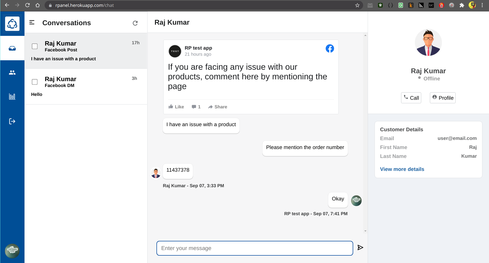

# FB_replier

Allows us to reply for Facebook messages and post comments from a single page with multiple conversations.

`npm start` starts the app in the development mode. \
If you run on localhost, open http://localhost:3000 to view it in the browser.

Github URLs: \
   Frontend: https://github.com/vh-praneeth/FB_replier \
   Backend: https://github.com/vh-praneeth/FB_replier_backend

Demo video: https://youtu.be/gi9VXvMlbaM \
Application status: working

All the features mentioned in the document are completed and working well.

## Latest screenshots: 

