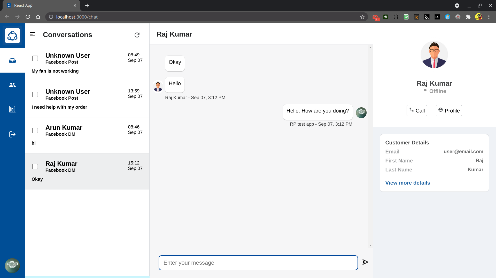
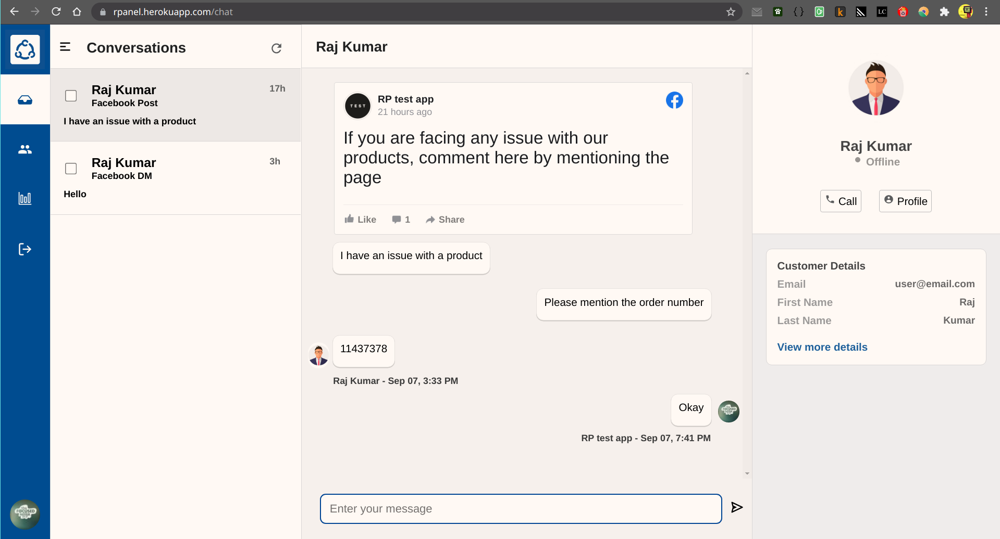

# RP_FB_replier

`npm start` starts the app in the development mode. \
If you run on localhost, open http://localhost:3000 to view it in the browser.

Deployed on http://praneethvit.ml/
and
https://rpanel.herokuapp.com/

Github URLs: \
   Frontend: https://github.com/vh-praneeth/RP_FB_replier \
   Backend: https://github.com/vh-praneeth/RP_FB_backend

Demo video: https://youtu.be/BX65O4est2Q \
Application status: working well

## Latest screenshots: 

